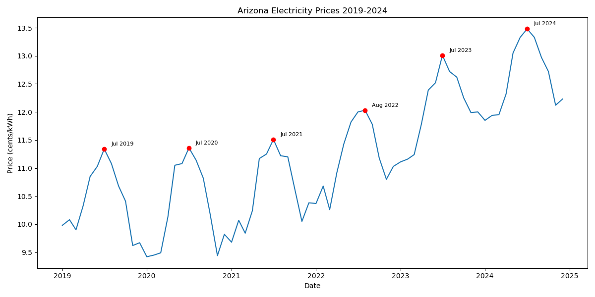
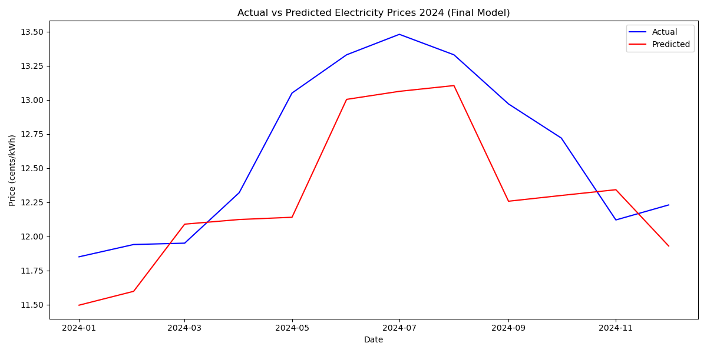

# Arizona Electricity Market Analysis & Forecasting

Python + Tableau analysis of Arizona retail electricity pricing and Henry Hub natural gas costs (2019–2024), sourced live from the EIA API, with seasonal trend analysis and a regression-based forecasting model.

## Why I built this

I built this model to better understand how Arizona electricity prices change over time — the seasonal patterns behind the fluctuations, whether natural gas prices play a role, and how well historical patterns can predict prices in a year the model hasn't seen. As someone who pays utility bills in Arizona myself, I wanted a clearer, data-backed picture of what drives these price shifts instead of just feeling them on my bill.

## What it does

- Pulls 6 years (2019–2024) of Arizona retail electricity prices and Henry Hub natural gas spot prices directly from the [EIA API](https://www.eia.gov/opendata/)
- Cleans, merges, and engineers time-based features (month, quarter, year, season) into a 72-observation monthly dataset
- Explores seasonal and year-over-year pricing patterns through summary statistics and visualizations
- Builds and compares two linear regression models to predict 2024 electricity prices from historical data
- Runs an ablation test to isolate the actual contribution of natural gas price to the model
- Publishes an interactive [Tableau Public dashboard](https://public.tableau.com/views/ArizonaElectricityMarketAnalysis20192024/ArizonaElectricityMarketAnalysis?:language=en-US&:display_count=n&:origin=viz_share_link) summarizing the key findings

## Key findings

- There is no linear correlation between electricity and gas prices (r ≈ -0.02).
- On average, summer electricity prices are 12.7% higher than winter, with price spikes concentrated in July and August each year. Prices show a generally upward trend since 2020, following a dip that year (likely tied to COVID-19).
- Despite showing no linear correlation with electricity price on its own, removing gas price from the model significantly reduced its predictive accuracy — R² dropped from 0.44 to 0.20 — suggesting gas price's effect is conditional on seasonal and yearly patterns rather than a simple direct relationship.
- Encoding month as a raw number caused the first model to perform worse than a naive average (R² = -0.28), since it forced December (12) and January (1) to opposite ends of the scale despite both being winter. Encoding season as a categorical variable instead raised R² to 0.44.

## Tech stack

**Python** (pandas, NumPy, scikit-learn, matplotlib, seaborn) · **Tableau Public** · **EIA API**

## Visuals




Full interactive dashboard: [view on Tableau Public](https://public.tableau.com/views/ArizonaElectricityMarketAnalysis20192024/ArizonaElectricityMarketAnalysis?:language=en-US&:display_count=n&:origin=viz_share_link)

## Limitations

- The 2024 test set is only 12 months, so the R² of 0.44 should be read as directionally meaningful rather than a precise, stable estimate.
- The model doesn't include a weather or cooling-demand variable (e.g., cooling degree days), which is a plausible driver of Arizona's summer price spikes and likely explains some of the unexplained variance.
- Only one modeling approach (linear regression) was tested; no cross-validation or alternative algorithms were compared.

## Data & files

```
notebook/   → arizona_electricity_analysis.ipynb (full analysis)
data/       → raw and processed CSVs (arizona_electricity.csv, natural_gas.csv, final_data.csv, forecast_data.csv)
charts/     → exported PNG charts
```

**Note:** the notebook reads CSVs by filename only (e.g. `pd.read_csv("final_data.csv")`), reflecting the original flat working directory. If re-running the notebook from this repo structure, update those paths to point to the `data/` folder (e.g. `pd.read_csv("../data/final_data.csv")`).
